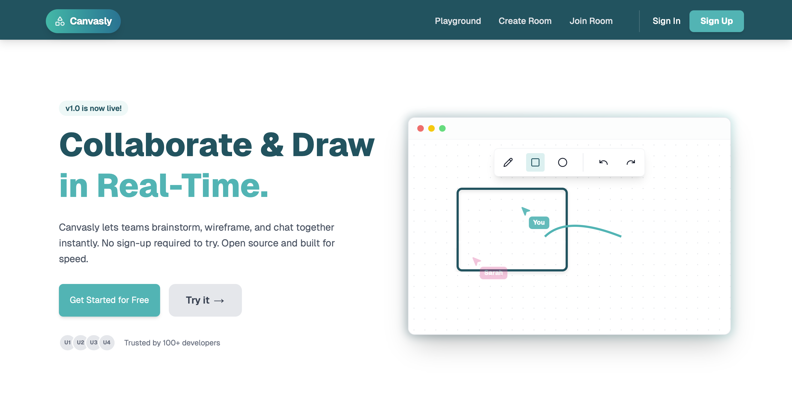

# Canvasly

> Real-Time Collaborative Whiteboard Built with Express.js, Next.js, WebSockets, Prisma, and Turborepo.

Canvasly is a lightweight collaborative canvas application designed for sketching ideas, drawing diagrams, and real-time visual brainstorming. It enables multiple users to collaborate simultaneously with consistent shared state and low-latency updates.

## Preview



---

## Features

- Real-time multi-user collaboration (WebSockets)
- Distributed state synchronization
- Drawing tools (pen, ellipse, eraser, delete, stroke width control)
- Optimistic UI updates
- Email OTP authentication with Nodemailer
- Secure password hashing with bcrypt
- Monorepo architecture using Turborepo
- End-to-end type safety with Zod + Prisma
- Dockerized deployment
- PostgreSQL persistence
- Clean UI built with TailwindCSS

---

## Architecture

Canvasly uses a scalable monorepo structure:

```
apps/
  http-backend  -> Express.js backend
  web/          -> Next.js frontend
  ws-backend    -> websocket
packages/
  backend-common   -> env config
  common           -> Shared Zod schemas & types
  db               -> Prisma schema & client
```

### Core Technologies

- **Frontend**: Next.js (App Router), TypeScript, TailwindCSS
- **Backend**: Express, WebSockets
- **Database**: PostgreSQL + Prisma ORM
- **Auth**: Email OTP verification (Nodemailer), JWT
- **Monorepo**: Turborepo + pnpm workspaces
- **Validation**: Zod

---

## Authentication Flow

1. User signs up
2. OTP sent via email (Nodemailer)
3. User verifies OTP
4. JWT issued after verification
5. Secure login with hashed passwords (bcrypt)

---

## Real-Time System Design

Canvasly implements:

- WebSocket-based state broadcasting
- Prevention of echo messages
- Race condition handling
- Optimistic rendering
- Conflict-safe deletion handling
- Shared room-based collaboration

---

## Docker Support

Build and run using:

```
docker-compose up --build
```

Handles:

- Prisma migrations
- DATABASE_URL injection
- Turbo build environment variables

---

## Installation (Local Development)

```bash
pnpm install
pnpm dev
```

To run specific app:

```bash
pnpm --filter web dev
pnpm --filter http-backend dev
pnpm --filter ws-backend dev
```

---

## Database Migrations

Migrations are managed with Prisma and must run **before** application containers start to avoid schema mismatches.

> Never run migrations inside `CMD`. When multiple replicas start simultaneously, this causes race conditions and breaks horizontal scaling.

---

### Railway

Railway does not support `depends_on: service_completed_successfully`, so use the pre-deploy command instead.

**Settings → Deploy → Pre-deploy Command:**

```bash
npx prisma migrate deploy --schema=packages/db/prisma/schema.prisma
```

This runs once per deployment. If it fails, the deployment is aborted and the existing container keeps running.

---

### Local / EC2 (Docker Compose)

Add a dedicated `migrate` service and make backends wait on it:

```yaml
services:
  migrate:
    build:
      context: .
      dockerfile: apps/http-backend/Dockerfile
    command: npx prisma migrate deploy --schema=packages/db/prisma/schema.prisma
    env_file:
      - .env

  http-server:
    build:
      context: .
      dockerfile: apps/http-backend/Dockerfile
    depends_on:
      migrate:
        condition: service_completed_successfully
    ports:
      - "8000:8000"
    env_file:
      - .env

  ws-server:
    depends_on:
      migrate:
        condition: service_completed_successfully
```

---

### GitHub Actions + EC2

Add a migration step in your CI pipeline before starting containers:

```yaml
- name: Run migrations
  run: |
    ssh ec2-user@${{ secrets.EC2_HOST }} \
    "cd /app && docker compose run --rm migrate"
```

---

### Platform Summary

| Platform          | Strategy                               |
| ----------------- | -------------------------------------- |
| Railway           | Pre-deploy command in dashboard        |
| EC2 / Self-hosted | Dedicated `migrate` service in Compose |
| GitHub Actions    | Migration step in CI before deploy     |

## Future Improvements

- Refresh token rotation
- Rate-limited OTP resend
- Redis-based session store
- Room-level access control
- Presence indicators (online users)
- CRDT-based state model

---
